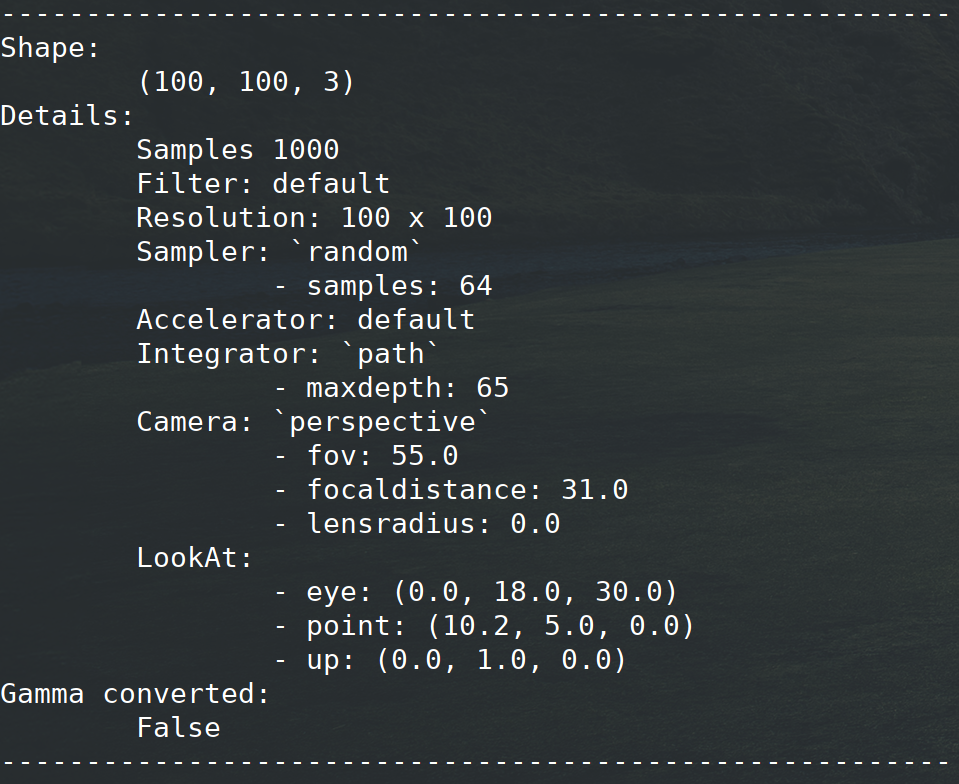
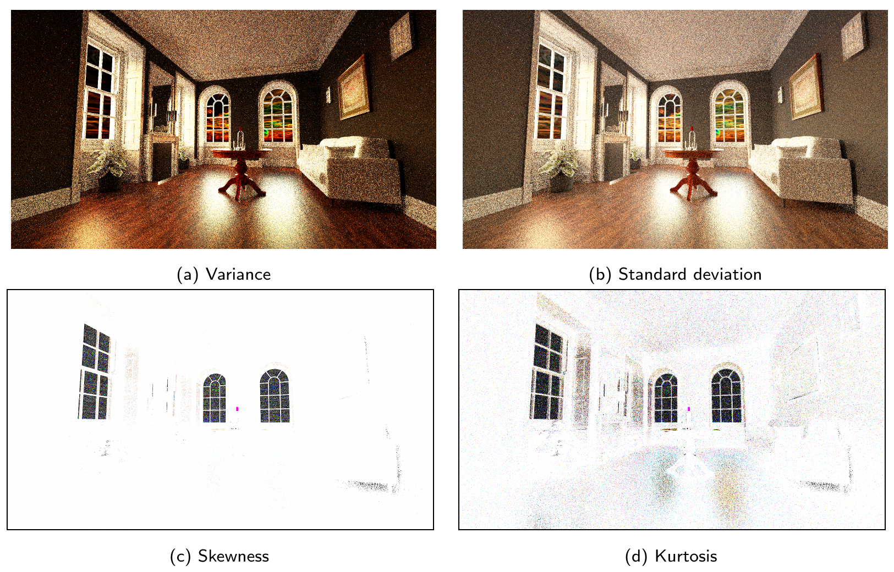

Examples
=====================================

Some examples are already available into documentation. You can find here some others and results of use of `rawls` package.

Processing example
--------------------

Read and save `.rawls` file:

.. code:: python
    
    from rawls.rawls import Rawls
    path = 'images/example_1.rawls'
    rawls_img = Rawls.load(path)
    rawls_img.to_png('output.png')

Display rendering information:

.. code:: python
    
    from rawls.rawls import Rawls
    path = 'images/example_1.rawls'
    rawls_img = Rawls.load(path)
    print(rawls_img)

Extract statistics from multiples `.rawls` samples files:

.. code:: python

    from rawls.rawls import Rawls
    from rawls.stats import RawlsStats
    path_list = ['images/example_1.rawls', 'images/example_2.rawls']
    rawls_stats = RawlsStats.load(path_list)
    print(rawls_stats)

.. code:: python

    rawls_mean = rawls_stats.mean()
    rawls_mean.save('output_mean.png')

.. image:: _static/output_mean.png
   :width: 120 px
   :align: center
